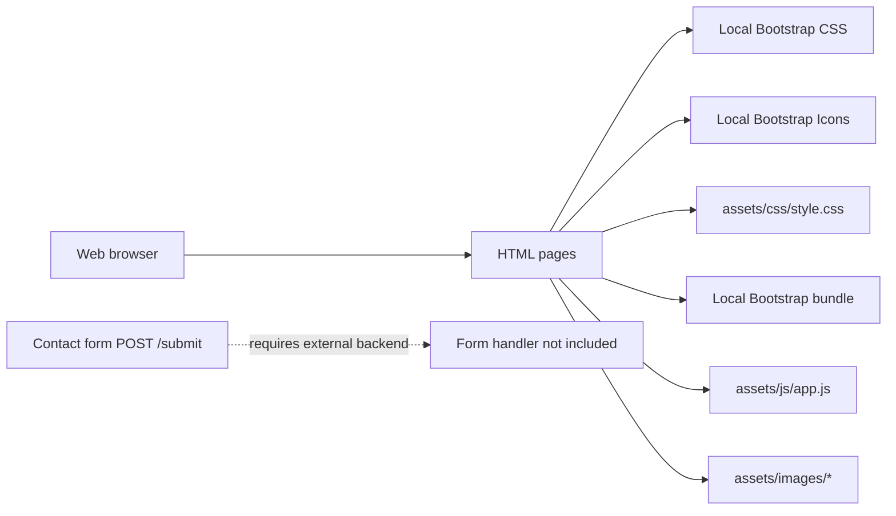
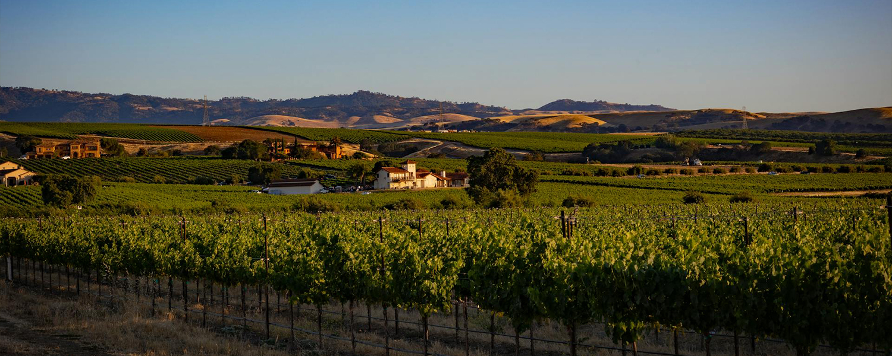
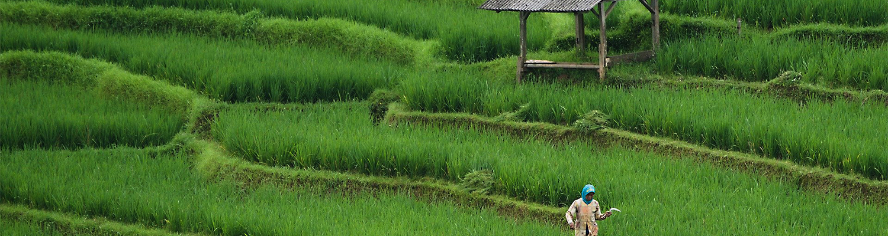
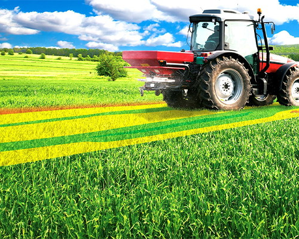
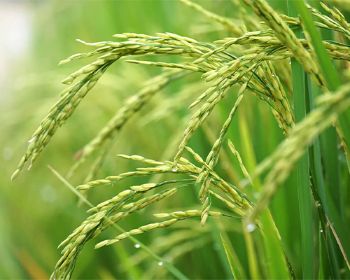
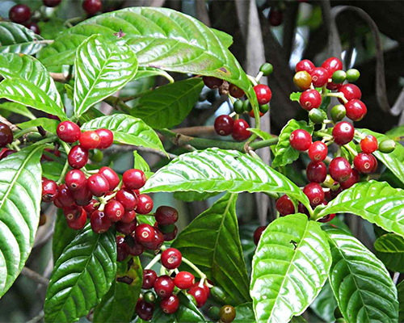

<!--
	Agricultural Information Hub
	Project documentation
-->

<div id="contents"></div>

# Contents

- [Agricultural Information Hub](#agricultural-information-hub)
- [Description](#description)
- [Key Features](#key-features)
- [Tech Stack](#tech-stack)
- [Live Architecture](#live-architecture)
- [Getting Started](#getting-started)
  - [Prerequisites](#prerequisites)
  - [Installation](#installation)
  - [Run Locally](#run-locally)
- [Environment Variables](#environment-variables)
- [Usage and Examples](#usage-and-examples)
  - [Page-by-Page Guide](#page-by-page-guide)
  - [Detailed Page and Tool Setup](#detailed-page-and-tool-setup)
  - [Navigation and Search](#navigation-and-search)
  - [Contact Form](#contact-form)
  - [Scroll-to-Top Control](#scroll-to-top-control)
- [Project Structure](#project-structure)
- [Production Checklist](#production-checklist)
- [Related Future Functionality](#related-future-functionality)
- [License](#license)

# Agricultural Information Hub

## Description

Agricultural Information Hub is a responsive, static information website for farmers, agricultural learners, and extension-service audiences. It brings practical farming guidance, crop reference data, pest-control education, and contact information into one simple browser-based resource.

The project is intentionally lightweight: it requires no build step, package manager, database, or runtime framework. Bootstrap and Bootstrap Icons are included locally so the site can run without a network connection after the repository is obtained.

[Back to Contents](#contents)

## Key Features

- **Agricultural reference content:** Browse crop farming, livestock, sustainable farming, aquaculture, agri-technology, and agricultural marketing topics.
- **Crop details:** Review representative grain, fruit, and cash-crop entries with varieties, soil requirements, and common uses.
- **Pest-management education:** Learn about integrated pest management, biological controls, organic remedies, and early detection.
- **Responsive navigation:** Move between all pages through a Bootstrap navigation bar that collapses on smaller screens.
- **Visual presentation:** Use hero banners, a home-page carousel, crop imagery, guide cards, and Bootstrap Icons.
- **Contact workflow UI:** Collect a name, email address, inquiry, and optional image or PDF attachment in the contact form.
- **Scroll-to-top interaction:** Reveal a floating control after the user scrolls more than 200 pixels and return smoothly to the top.
- **Offline-friendly dependencies:** Load Bootstrap, Bootstrap Icons, images, CSS, and JavaScript from repository-local paths.

[Back to Contents](#contents)

## Tech Stack

| Area         | Technology                               | Use in this project                                            |
| ------------ | ---------------------------------------- | -------------------------------------------------------------- |
| Markup       | HTML5                                    | Page structure, navigation, content, and forms                 |
| Styling      | CSS3                                     | Custom banners, carousel indicators, and scroll-to-top control |
| UI framework | Bootstrap 5.3.3                          | Grid, navbar, cards, forms, carousel, and responsive utilities |
| Icons        | Bootstrap Icons 1.11.3                   | Footer social links and interface icon support                 |
| Behavior     | Vanilla JavaScript                       | Scroll-to-top visibility and smooth scrolling                  |
| Assets       | Local JPG and PNG files                  | Logos, hero banners, crop images, and guide imagery            |
| Runtime      | Modern web browser or static HTTP server | Serves the site directly                                       |

[Back to Contents](#contents)

## Live Architecture

The current architecture is a client-side static site. There is no API, database, build pipeline, or server-side form handler in this repository.



### Request and rendering sequence

1. Open an HTML entry page in a browser or request it from a static HTTP server.
2. The browser loads the page's local Bootstrap CSS, Bootstrap Icons, custom CSS, images, and JavaScript.
3. Bootstrap initializes responsive navigation and the home-page carousel.
4. `assets/js/app.js` connects to the `scrollToTopBtn` element and manages its display state.
5. The contact form sends a `POST` request to `/submit`; a separate server must implement that route for submissions to be stored or delivered.

[Back to Contents](#contents)

## Getting Started

### Prerequisites

Install or have access to:

- Git, if cloning the repository.
- A modern browser such as Chrome, Edge, Firefox, or Safari.
- Optional: Python 3, Node.js, PHP, or another simple static HTTP server for local hosting.

No `npm install`, `pip install`, compilation, database, or environment file is required for the frontend as currently implemented.

### Installation

Clone the repository and enter its directory:

```bash
git clone <repository-url>
cd Agricultural-Information-Hub
```

If the project was downloaded as an archive, extract it and open a terminal in the extracted project directory. Keep the `vendor/` and `assets/` directories beside the HTML files so relative asset paths continue to resolve.

### Run Locally

#### Option 1: Open the entry page directly

Open `index.html` in a browser. This is sufficient for viewing the static pages and most client-side interactions.

#### Option 2: Serve with Python

Start a local HTTP server from the project root:

```bash
python -m http.server 8000
```

Open the site at:

```text
http://localhost:8000/index.html
```

Stop the server with `Ctrl+C`.

#### Option 3: Serve with Node.js

If Node.js is available, run a temporary static server without adding project dependencies:

```bash
npx --yes http-server . -p 8080
```

Then open:

```text
http://localhost:8080/index.html
```

The `npx` option may download the temporary server package. The repository itself still has no Node.js dependency manifest.

#### Option 4: Serve with PHP

```bash
php -S localhost:8000
```

Open `http://localhost:8000/index.html` in a browser.

[Back to Contents](#contents)

## Environment Variables

No environment variables are used by the current static frontend.

```env
# No environment variables are required.
```

If a backend is added for contact submissions, keep secrets such as SMTP credentials, API keys, and database URLs outside the repository and document only their names and safe examples here.

[Back to Contents](#contents)

## Usage and Examples

### Page-by-Page Guide

Use the shared navigation or open an entry page directly:

| Page           | File                                         | Purpose                                                                                                                           |
| -------------- | -------------------------------------------- | --------------------------------------------------------------------------------------------------------------------------------- |
| Home           | [`index.html`](index.html)                   | Introduction, featured sections, guide previews, crop previews, pest-control preview, and the main contact area                   |
| Farming Guides | [`farming_guides.html`](farming_guides.html) | Sequential guide cards for crop farming, livestock, sustainable techniques, aquaculture, agri-technology, and marketing/economics |
| Crop Details   | [`crop_details.html`](crop_details.html)     | Reference cards grouped into grains, fruits, and cash crops                                                                       |
| Pest Control   | [`pest_control.html`](pest_control.html)     | Integrated pest management, biological controls, organic remedies, and monitoring guidance                                        |
| Contact Us     | [`contact.html`](contact.html)               | Inquiry form, optional attachment field, telephone contact, and email contact                                                     |

### Detailed Page and Tool Setup

Follow this sequence when setting up, reviewing, or extending the site. Every page is a standalone HTML document, so each page must load the shared assets it uses.

#### 1. Shared page shell

Start each page with the HTML5 document declaration, responsive viewport, metadata, and the same local dependency order:

```html
<!doctype html>
<html lang="en">
  <head>
    <meta charset="utf-8" />
    <meta name="viewport" content="width=device-width, initial-scale=1" />
    <meta
      name="description"
      content="Agricultural information and resources for farmers."
    />
    <title>Agricultural Information Hub</title>

    <link
      rel="stylesheet"
      href="vendor/bootstrap-5.3.3/css/bootstrap.min.css"
    />
    <link
      rel="stylesheet"
      href="vendor/bootstrap-icons-1.11.3/font/bootstrap-icons.min.css"
    />
    <link rel="stylesheet" href="assets/css/style.css" />
  </head>
  <body>
    <!-- Page-specific header and main content go here. -->

    <script src="vendor/bootstrap-5.3.3/js/bootstrap.bundle.min.js"></script>
    <script src="assets/js/app.js"></script>
  </body>
</html>
```

Load Bootstrap before the custom stylesheet so project-specific rules can override framework defaults. Load the Bootstrap bundle before `app.js` so the responsive navbar and carousel are initialized before custom page behavior runs.

#### 2. Shared navigation and footer

Copy the navigation and footer structure from an existing page when creating a new page. Update the active navigation item and its `aria-current` value:

```html
<nav class="navbar navbar-expand-lg">
  <div class="container-fluid">
    <a class="navbar-brand" href="index.html">
      
    </a>

    <button
      class="navbar-toggler"
      type="button"
      data-bs-toggle="collapse"
      data-bs-target="#navbarSupportedContent"
      aria-controls="navbarSupportedContent"
      aria-expanded="false"
      aria-label="Toggle navigation"
    >
      <span class="navbar-toggler-icon"></span>
    </button>

    <div class="collapse navbar-collapse" id="navbarSupportedContent">
      <ul class="navbar-nav mx-auto mb-2 mb-lg-0 fw-semibold">
        <li class="nav-item"><a class="nav-link" href="index.html">Home</a></li>
        <li class="nav-item">
          <a class="nav-link" href="farming_guides.html">Farming Guides</a>
        </li>
        <li class="nav-item">
          <a class="nav-link" href="crop_details.html">Crop Details</a>
        </li>
        <li class="nav-item">
          <a class="nav-link" href="pest_control.html">Pest Control</a>
        </li>
        <li class="nav-item">
          <a class="nav-link" href="contact.html">Contact Us</a>
        </li>
      </ul>
    </div>
  </div>
</nav>
```

Each page also includes the shared footer for social links and attribution, followed by the scroll-to-top button:

```html
<footer class="bg-dark text-light py-5">
  <div class="container">
    <p class="mb-0 text-center">Agricultural Information Hub</p>
  </div>
</footer>

<button
  id="scrollToTopBtn"
  class="scroll-to-top"
  type="button"
  aria-label="Scroll to top"
>
  ↑
</button>
```

#### 3. Home page: `index.html`

The home page is the content hub and should be the default entry point.

1. Keep the shared navbar at the top.
2. Add the three-slide Bootstrap carousel using `banner.jpg`, `banner2.jpg`, and `banner3.jpg`.
3. Add the introduction section with `about.jpg`.
4. Add featured links or summaries for farming guides, crop details, and pest control.
5. Add preview sections for guides, crops, and pest-control content.
6. Keep the contact form and footer after the informational sections.

The carousel requires a unique ID, indicators that target the same ID, and the Bootstrap bundle:

```html
<div
  id="carouselExampleCaptions"
  class="carousel slide"
  data-bs-ride="carousel"
  data-bs-interval="3000"
>
  <div class="carousel-indicators">
    <button
      type="button"
      data-bs-target="#carouselExampleCaptions"
      data-bs-slide-to="0"
      class="active"
      aria-label="Slide 1"
    ></button>
    <button
      type="button"
      data-bs-target="#carouselExampleCaptions"
      data-bs-slide-to="1"
      aria-label="Slide 2"
    ></button>
  </div>
  <div class="carousel-inner">
    <div class="carousel-item active">
      
    </div>
    <div class="carousel-item">
      
    </div>
  </div>
</div>
```

#### 4. Farming Guides page: `farming_guides.html`

This page presents six sequential guide cards. Keep the content order and use one card per topic:

```html
<section class="farming_guides_section">
  <div class="container">
    <h3 class="fw-bold pt-5">Guides</h3>
    <div class="row">
      <div class="col-lg-12">
        <article class="card mb-3">
          <div class="row g-0 align-items-center">
            <div class="col-md-4">
              
            </div>
            <div class="col-md-8">
              <div class="card-body">
                <h4 class="card-title">Crop Farming</h4>
                <p class="card-text">
                  Selection, soil preparation, planting, and maintenance
                  guidance.
                </p>
                <a href="#" class="btn btn-info">Read More</a>
              </div>
            </div>
          </div>
        </article>
      </div>
    </div>
  </div>
</section>
```

The current topics are crop farming, livestock farming, sustainable farming techniques, aquaculture, agri-technology integration, and marketing/economics. Replace placeholder `#` links with real detail pages before production.

#### 5. Crop Details page: `crop_details.html`

Group crop cards under the existing categories: Grains, Fruits, and Cash Crops. Each card should include an image, crop name, varieties, soil requirements, and uses:

```html
<section class="crop-details py-5">
  <div class="container">
    <div class="mb-5">
      <h2>Grains</h2>
      <div class="row">
        <div class="col-md-6 mb-3">
          <article class="card">
            
            <div class="card-body">
              <h5 class="card-title">Rice</h5>
              <p class="card-text">
                <strong>Varieties:</strong> Basmati, Jasmine<br />
                <strong>Soil:</strong> Clayey soil, pH 5.5-7<br />
                <strong>Uses:</strong> Food staple, flour, brewing
              </p>
            </div>
          </article>
        </div>
      </div>
    </div>
  </div>
</section>
```

The current reference entries are Rice, Wheat, Apple, Banana, Cotton, and Coffee. Preserve the image path and update the `alt` text whenever a crop is changed.

#### 6. Pest Control page: `pest_control.html`

Build this page as a sequence of educational sections rather than treatment recommendations for a specific farm. The current sequence is Integrated Pest Management, Biological Controls, Organic Remedies, and Monitoring and Early Detection:

```html
<section class="pest_control_strategies mt-5">
  <div class="container">
    <div class="mb-5">
      <h2>Integrated Pest Management (IPM)</h2>
      <div class="row">
        <div class="col-md-6 mb-3">
          <article class="card">
            <div class="card-body">
              <h5 class="card-title">Core Components</h5>
              <p class="card-text">
                <strong>Cultural Controls:</strong> Crop rotation<br />
                <strong>Mechanical Controls:</strong> Traps and barriers<br />
                <strong>Biological Controls:</strong> Natural predators
              </p>
            </div>
          </article>
        </div>
      </div>
    </div>
  </div>
</section>
```

When expanding pest content, include local agricultural guidance and appropriate safety notes. Do not present the static page as a substitute for a qualified agricultural professional or local product regulations.

#### 7. Contact page: `contact.html`

The contact page combines a multipart inquiry form with direct phone and email contact cards. The minimum form controls are `name`, `email`, and `message`; `attachment` is optional:

```html
<form action="/submit" method="POST" enctype="multipart/form-data">
  <label for="name">Name</label>
  <input type="text" id="name" name="name" required />

  <label for="email">Email</label>
  <input type="email" id="email" name="email" required />

  <label for="message">Your Inquiry</label>
  <textarea id="message" name="message" rows="4" required></textarea>

  <label for="attachment">Attachment (optional)</label>
  <input
    type="file"
    id="attachment"
    name="attachment"
    accept="image/*,application/pdf"
  />

  <button type="submit" class="btn btn-primary">Submit</button>
</form>
```

The form markup only performs browser-side validation. A production handler must authenticate or protect the endpoint as appropriate, validate and limit uploads, sanitize text, prevent abuse, and return a user-facing success or error response.

#### 8. Bootstrap CSS and responsive layout

Use Bootstrap's container, grid, card, spacing, and responsive utility classes before adding custom CSS. The local stylesheet is loaded last:

```html
<link rel="stylesheet" href="vendor/bootstrap-5.3.3/css/bootstrap.min.css" />
<link rel="stylesheet" href="assets/css/style.css" />
```

The existing custom rules define banner backgrounds and the scroll-to-top control:

```css
header .banner {
  background-size: cover;
  background-position: center center;
  height: 32vh;
}

.scroll-to-top {
  position: fixed;
  right: 20px;
  bottom: 20px;
  display: none;
}
```

#### 9. Bootstrap Icons

Load the local icon stylesheet and use Bootstrap Icons through the `bi` class prefix:

```html
<link
  rel="stylesheet"
  href="vendor/bootstrap-icons-1.11.3/font/bootstrap-icons.min.css"
/>

<a href="https://www.linkedin.com/" aria-label="LinkedIn">
  <i class="bi bi-linkedin" aria-hidden="true"></i>
</a>
```

Keep icon-only controls labelled with visible text or an `aria-label` so they remain usable with assistive technology.

#### 10. Shared JavaScript scroll-to-top tool

The button ID and script must be present together on every page. The current script reveals the button after 200 pixels and scrolls smoothly to the document top:

```javascript
const scrollToTopBtn = document.getElementById("scrollToTopBtn");

window.onscroll = function () {
  if (document.documentElement.scrollTop > 200) {
    scrollToTopBtn.style.display = "block";
  } else {
    scrollToTopBtn.style.display = "none";
  }
};

scrollToTopBtn.addEventListener("click", function () {
  window.scrollTo({ top: 0, behavior: "smooth" });
});
```

If a new page does not include the button, update the script to guard against a missing element before adding event listeners.

#### 11. Images and asset paths

Store page images in `assets/images/` and reference them with paths relative to the HTML file:

```html

```

Current image groups include `banner*.jpg`, `innerBanner*.jpg`, guide images, crop images, `ladybug.jpg`, `about.jpg`, and `logo.png`. File names are case-sensitive on many production hosts, so use the exact existing spelling, including `wheet.jpg` and `bananna.jpg`, or rename the files and update every reference together.

#### 12. Final setup verification

After adding or changing a page, verify the complete chain in order:

```text
1. HTML file exists at the project root.
2. Bootstrap CSS and Bootstrap Icons paths resolve.
3. assets/css/style.css resolves.
4. Every referenced image exists in assets/images/.
5. Bootstrap bundle loads before assets/js/app.js.
6. The page includes #scrollToTopBtn.
7. Navigation links open every HTML page.
8. Layout works at desktop and mobile widths.
9. Contact submission is tested against a real /submit handler, if configured.
```

### Navigation and Search

1. Start at [`index.html`](index.html).
2. Select **Farming Guides**, **Crop Details**, **Pest Control**, or **Contact Us** in the navigation bar.
3. On a smaller viewport, select the Bootstrap navbar toggle to reveal the links.
4. The visible search form is present on each page, but it currently has no action or JavaScript search implementation. It does not filter or query the content yet.

The page links can also be opened directly:

```text
index.html
farming_guides.html
crop_details.html
pest_control.html
contact.html
```

### Contact Form

Complete the form in [`contact.html`](contact.html) with a name, valid email address, inquiry, and optional image or PDF attachment. The browser performs basic required-field and email validation before submitting:

```http
POST /submit
Content-Type: multipart/form-data

name=<full name>
email=<email address>
message=<inquiry text>
attachment=<optional image or PDF, up to 5 MB as described by the UI>
```

The form endpoint is not implemented in this repository. On static hosting, submission will fail or return a 404 unless `/submit` is supplied by a backend, serverless function, or form-processing provider. Validate file size and type on the server as well; the HTML `accept` attribute is not a security boundary.

### Scroll-to-Top Control

Every page includes the shared script [`assets/js/app.js`](assets/js/app.js) and a button with the ID `scrollToTopBtn`:

```html
<button id="scrollToTopBtn" class="scroll-to-top">↑</button>
<script src="assets/js/app.js"></script>
```

After the document scroll position passes 200 pixels, the button becomes visible. Selecting it calls `window.scrollTo` with smooth scrolling enabled.

[Back to Contents](#contents)

## Project Structure

```text
Agricultural-Information-Hub/
├── index.html                    # Home page and content overview
├── farming_guides.html            # Farming practice guides
├── crop_details.html              # Crop reference cards
├── pest_control.html              # Pest-management guidance
├── contact.html                   # Contact and inquiry form
├── assets/
│   ├── css/
│   │   └── style.css              # Project-specific styles
│   ├── images/                    # Logos, banners, crop, and guide images
│   └── js/
│       └── app.js                 # Scroll-to-top behavior
└── vendor/
		├── bootstrap-5.3.3/
		│   ├── css/bootstrap.min.css
		│   └── js/bootstrap.bundle.min.js
		└── bootstrap-icons-1.11.3/
				├── font/bootstrap-icons.css
				├── font/bootstrap-icons.min.css
				└── font/fonts/             # Bootstrap Icons font files
```

### Adding or updating content

1. Edit the relevant HTML page and preserve its relative paths.
2. Add new images to `assets/images/` using web-friendly dimensions and compressed file sizes.
3. Add meaningful `alt` text for informative images.
4. Keep shared navigation, footer markup, Bootstrap references, and the scroll-to-top button consistent across pages.
5. Preview every affected page at desktop and mobile widths.

[Back to Contents](#contents)

## Production Checklist

- Replace placeholder `#` links on guide cards with real detail pages or remove the buttons.
- Connect the contact form's `/submit` action to a validated backend or managed form provider.
- Enforce the stated 5 MB upload limit and allowlist MIME types server-side.
- Implement the search form or remove it until search exists.
- Add a privacy notice and consent handling if inquiries or attachments are retained.
- Confirm image licensing, optimize image sizes, and verify accessibility with keyboard navigation and a screen reader.
- Add automated HTML, link, accessibility, and responsive smoke checks to the deployment pipeline.
- Configure HTTPS, security headers, caching, compression, and an error page on the chosen host.

[Back to Contents](#contents)

## Related Future Functionality

The following additions fit the project direction but are not included in the current implementation:

- **Content search and filtering:** Search guide and crop content by keyword, crop type, region, season, or soil condition.
- **Dynamic crop database:** Move crop records into JSON or a backend so entries can be updated without duplicating HTML.
- **Seasonal and regional recommendations:** Tailor guidance using location, climate, planting calendar, and local regulations.
- **Weather and market integrations:** Display forecast alerts, commodity prices, and market trends through authenticated APIs.
- **Farmer accounts:** Provide saved crops, personalized plans, bookmarks, and inquiry history.
- **Expert knowledge workflow:** Add moderated articles, question-and-answer threads, and extension-service profiles.
- **Notifications:** Send weather, pest, planting, and harvest reminders through email, SMS, or push notifications.
- **Localization:** Offer Bangla and other regional languages with accessible language switching.
- **Offline-first support:** Add a service worker and cached content for low-connectivity environments.
- **Analytics and observability:** Track useful, privacy-conscious engagement metrics and monitor form delivery failures.

These capabilities require additional backend, data, privacy, security, and maintenance decisions; they should be designed before being added to the static frontend.

[Back to Contents](#contents)

## License

This project is intended to be released under the [MIT License](https://opensource.org/licenses/MIT). Add a root-level `LICENSE` file containing the full MIT License text before distributing a production release.

[Back to Contents](#contents)
